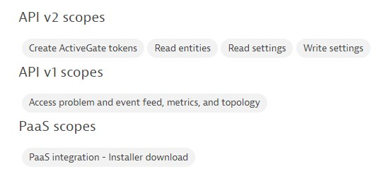
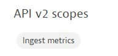

# Dynatrace OneAgent K8s Workshop

## Step 1 - Prerequisites
- Hypervisor installation (VMWare, Hyper-V, Qemu,...)
- Ubuntu20.04 64bit (desktop or server) - 40Gb disk, 12GB RAM
- Installation [Docker, Kind, Kubectl](https://github.com/dt-wv/k8s/tree/main/workshop/README.md)
- Access internet  
- Dynatrace tenant with Admin rights (token creation,...)

## Step 2 - Bank-of-Anthos application deployment
`$ sudo su -`  
`# apt-get install -y git`  
`# cd $HOME; git clone https://github.com/dt-wv/bank-of-anthos.git`  
`# cd bank-of-anthos`  
`# kubectl create ns bank-of-anthos-oa`  
`# kubectl apply -f ./extra/jwt/ --namespace=bank-of-anthos-oa`  
`# kubectl apply -f ./kubernetes-manifests/ --namespace=bank-of-anthos-oa`  
`# sleep 120 && kubectl get pods -n bank-of-anthos-oa`  

## Step 3 - install Dynatrace as ApplicationOnly
`$ sudo su -`

Go to the link of the Dynatrace documentation for a [ApplicationOnly](https://docs.dynatrace.com/docs/setup-and-configuration/setup-on-k8s/installation/app-observability-automated#manifest) installation and execute all steps until step 4.  
On Step 2 take <b>without</b> CSI driver.  

<b>Operator token scopes:</b>  

<b>Data ingest token scopes:</b>  

Dynakube can be downloaded and please replace the 'name' and 'apiurl' with the correct value.  
`# curl -LO https://raw.githubusercontent.com/dt-wv/k8s/main/ApplicationMonitoring/dynakube-applicationMonitoring-generic-without-csi.yml`  
`# vi dynakube-applicationMonitoring-generic-without-csi.yml`  
`# kubectl apply -f dynakube-applicationMonitoring-generic-without-csi.yml`

## Step 4 - Modify the namespace (add the label of the namespaceselector used in the Dynakube)

`# kubectl patch ns bank-of-anthos-oa -p '{"metadata":{"labels":{"instrumentation":"oneagent"}}}'`  
or  
`# kubectl edit ns bank-of-anthos-oa`
## step 5 - restart the deployments
`# for i in $(kubectl get deployments -n bank-of-anthos-oa | awk '{print $1}'); do kubectl rollout restart deployment -n bank-of-anthos-oa $1; done`

